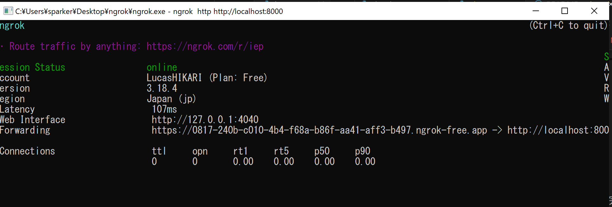
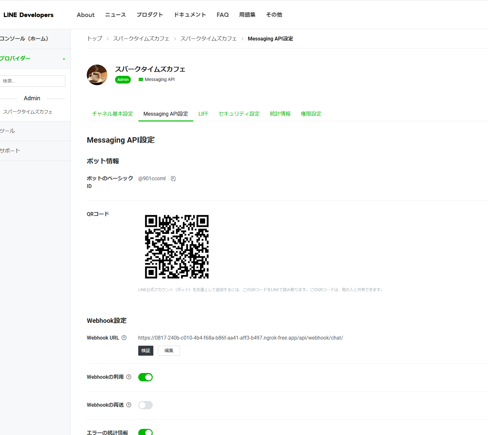

# line-liff-backend
## 仮想環境を作成
cd lineapp
python -m venv venv

## 仮想環境有効化
cd lineapp
.\venv\Scripts\activate

## ライブラリ有効化
pip install -r requirements.txt

## set environment

## start
python manage.py runserver

## AI chat
開発環境にバックエンドがデプロイまだ未完了のため、
AI chat モジュールではNAT トラバーサルが必要となります。
手順は以下の通りです：
１．ngrokクライアントの起動

２．Line Webhookアドレスの設定
（１図のForwarding 前の部分は前の部分が設定すべきURLとなります）
